# Cryptocurrencies

## Overview of Project
You and Martha have done your research. You understand what unsupervised learning is used for, how to process data, how to cluster, how to reduce your dimensions, and how to reduce the principal components using PCA. It’s time to put all these skills to use by creating an analysis for your clients who are preparing to get into the cryptocurrency market.

Martha is a senior manager for the Advisory Services Team at Accountability Accounting, one of your most important clients. Accountability Accounting, a prominent investment bank, is interested in offering a new cryptocurrency investment portfolio for its customers. The company, however, is lost in the vast universe of cryptocurrencies. So, they’ve asked you to create a report that includes what cryptocurrencies are on the trading market and how they could be grouped to create a classification system for this new investment.

The data Martha will be working with is not ideal, so it will need to be processed to fit the machine learning models. Since there is no known output for what Martha is looking for, she has decided to use unsupervised learning. To group the cryptocurrencies, Martha decided on a clustering algorithm. She’ll use data visualizations to share her findings with the board.

## Deliverables:
This new assignment consists of three technical analysis deliverables and a written report.

1. ***Deliverable 1:*** Preprocessing the Data for PCA
2. ***Deliverable 2:*** Reducing Data Dimensions Using PCA
3. ***Deliverable 3:*** Clustering Cryptocurrencies Using K-means
4. ***Deliverable 4:*** Visualizing Cryptocurrencies Results

### Steps for Preparing Data

**After** digging into unsupervised learning a bit, you realize that your first step in convincing Accountability Accountants to invest in cryptocurrency is to preprocess the data.

You and Martha open up the dataset to get started preprocessing it. Together, you will want to manage unnecessary columns, rows with null values, and mixed data types before turning your algorithm loose.

**Before** moving data to our unsupervised algorithms, complete the following steps for preparing data:

1. Data selection
2. Data processing
3. Data transformation

### Data Selection
Data selection entails making good choices about which data will be used. Consider what data is available, what data is missing, and what data can be removed. For example, say we have a dataset on city weather that consists of temperature, population, latitude and longitude, date, snowfall, and income. After looking through the columns, we can readily see that population and income data don't affect weather. We might also notice some rows are missing temperature data. In the data selection process, we would remove the population and income columns as well as any rows that don't record temperatures.

### Data Processing
Data processing involves organizing the data by formatting, cleaning, and sampling it. In our dataset on city weather, if the date column has two different formats—mm-dd-yyyy (e.g., 01-23-1980) and month-data-year (e.g., jan-23-1980)—we would convert all dates to the same format.

### Data Transformation
Data transformation entails transforming our data into a simpler format for storage and future use, such as a CSV, spreadsheet, or database file. Once our weather data is cleaned and processed, we would export the final version of the data as a CSV file for future analysis.

# Deliverable 1:  
## Preprocessing the Data for PCA
### Deliverable Requirements:

Using your knowledge of Pandas, you’ll preprocess the dataset in order to perform PCA in Deliverable 2

1. Read in the `crypto_data.csv` to the Pandas DataFrame named `crypto_df`. The `crypto_data.csv` was retrieved from [CryptoCompare](https://min-api.cryptocompare.com/data/all/coinlist).
2. Keep all the cryptocurrencies that are being traded.
3. Keep all the cryptocurrencies that have a working algorithm.
4. Drop the `IsTrading` column.
5. Remove rows that have at least one null value.
6. Filter the `crypto_df` DataFrame so it only has rows where coins have been mined.
7. Create a new DataFrame that holds only the cryptocurrency names, and use the crypto_df DataFrame index as the index for this new DataFrame.
8. Remove the `CoinName` column from the `crypto_df` DataFrame since it's not going to be used on the clustering algorithm.

Take a moment to check that your `crypto_df` DataFrame looks like the image below:

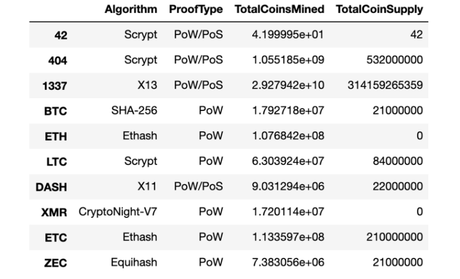

9. Use the `get_dummies()` method to create variables for the two text features, `Algorithm` and `ProofType`, and store the resulting data in a new DataFrame named `X`.
10. Use the StandardScaler `fit_transform()` function to standardize the features from the `X` DataFrame.

#### Deliverable 1 Requirements

* The following six preprocessing steps have been performed on the `crypto_df` DataFrame:
    - All cryptocurrencies that are not being traded are removed
    - All cryptocurrencies that do not have a defined algorithm are removed
    - The `IsTrading` column is dropped 
    - All the rows that have at least one null value are removed 
    - All the rows that do not have coins being mined are removed 
    - The `CoinName` column is dropped
* A new DataFrame is created that stores all cryptocurrency names from the CoinName column and retains the index from the `crypto_df` DataFrame 
* The `get_dummies()` method is used to create variables for the text features, which are then stored in a new DataFrame, `X` 
* The features from the `X` DataFrame have been standardized using the StandardScaler `fit_transform()` function 

## Deliverable 1 Results
### Preprocessing the Data for PCA
The following was done to preprocess the data:

1. Remove cryptocurrencies not being traded.
2. Keep all the cryptocurrencies that have a working algorithm
3. The `IsTrading` column it was dropped.
4. Rows that have null value were dropped.
5. Filter dataset with only mined coins.
6. Create a new DataFrame `CoinNames`, and use the index from the previous dataset as the index for this new DataFrame `cc_names_df`  

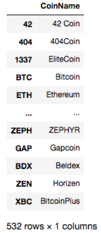

7. Remove `CoinName` unnecessary column from the DataFrame `crypto_df`    

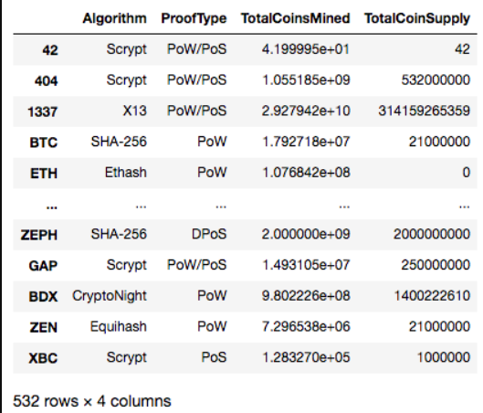

From `get_dummies()` method over columns `Algorithm` and `ProofType` and using the StandardScaler `fit_transform()` function to standardize the features. 

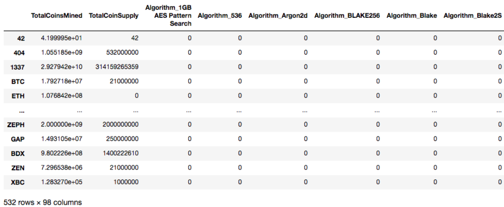

# Deliverable 2:  
## Reducing Data Dimensions Using PCA 
### Deliverable Requirements:

Using your knowledge of how to apply the Principal Component Analysis (PCA) algorithm, you’ll reduce the dimensions of the `X` DataFrame to three principal components and place these dimensions in a new DataFrame.

**Follow the instructions below:**

Follow the instructions below and use the information in the `crypto_clustering_starter_code.ipynb` file to complete Deliverable 2.

1. Continue using the `crypto_clustering.ipynb` file from Deliverable 1 where you’ve already performed the preprocessing steps.
2. Using the information we’ve provided, apply PCA to reduce the dimensions to three principal components.

If you’d like a hint on how to use the PCA algorithm, that’s totally okay. If not, that’s great too. You can always revisit this later if you change your mind.

3. Create a new DataFrame named `pcs_df` that includes the following columns, `PC 1`, `PC 2`, and `PC 3`, and uses the index of the `crypto_df` DataFrame as the index.

Your DataFrame should look like the image below:

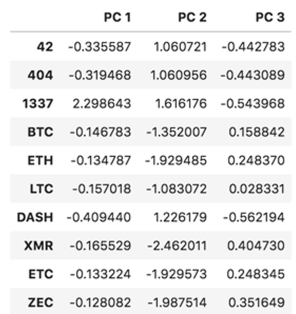

Save your `crypto_clustering.ipynb` file to your **Cryptocurrencies** folder.

#### Deliverable 2 Requirements

- The PCA algorithm reduces the dimensions of the `X` DataFrame down to three principal components 
- The `pcs_df` DataFrame is created and has the following three columns, `PC 1`, `PC 2`, and `PC 3`, and has the index from the `crypto_df` DataFrame  

## Deliverable 2 Results
### Reducing Data Dimensions Using PCA
The next steps involve, applying PCA to reduce the dimensions to 3 principal components.

The analysis from DataFrame, `pcs_df` includes columns `PC 1`, `PC 2`, and `PC 3`, and uses the index of the `crypto_df` DataFrame as the index.  

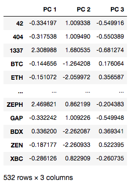

# Deliverable 3:  
## Clustering Cryptocurrencies Using K-means 
### Deliverable Requirements:

Using your knowledge of the K-means algorithm, you’ll create an elbow curve using `hvPlot` to find the best value for K from the `pcs_df` DataFrame created in Deliverable 2. Then, you’ll run the K-means algorithm to predict the K clusters for the cryptocurrencies’ data.

**Follow the instructions below:**

Follow the instructions below and use the information in the crypto_clustering_starter_code.ipynb file to complete Deliverable 3.

1. Continue using the `crypto_clustering.ipynb` file that you used in Deliverable 2 to reduce the dataset to three dimensions.
2. Using the `pcs_df` DataFrame, create an elbow curve using `hvPlot` to find the best value for **K**.
3. Next, use the `pcs_df` DataFrame to run the K-means algorithm to make predictions of the K clusters for the cryptocurrencies’ data.
If you’d like a hint on how to use the K-means algorithm, that’s totally okay. If not, that’s great too. You can always revisit this later if you change your mind.
4. Create a new DataFrame named `clustered_df` by concatenating the `crypto_df` and `pcs_df` DataFrames on the same columns. The index should be the same as the `crypto_df` DataFrame.
5.  Add the CoinName column that holds the names of the cryptocurrencies, which you created in Step 7 of Deliverable 1, to the `clustered_df`.
6. Add another new column to the `clustered_df` named `Class` that holds the predictions, i.e.,` model.labels_`, from Step 3.

Your `clustered_df` DataFrame should look like the image below:

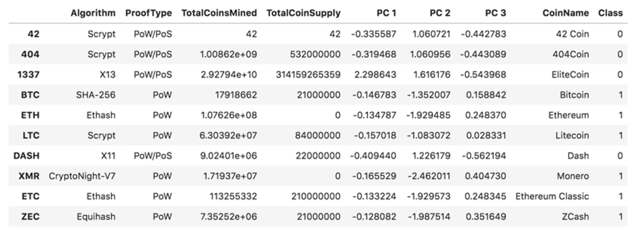
Save your `crypto_clustering.ipynb` file to your **Cryptocurrencies** folder.

#### Deliverable 3 Requirements

* The K-means algorithm is used to cluster the cryptocurrencies using the PCA data, where the following steps have been completed:
    - An elbow curve is created using `hvPlot` to find the best value for K 
    - Predictions are made on the K clusters of the cryptocurrencies’ data 
    - A new DataFrame is created with the same index as the `crypto_df` DataFrame and has the following columns: `Algorithm`, `ProofType`, `TotalCoinsMined`, `TotalCoinSupply`, `PC 1`, `PC 2`, `PC 3`, `CoinName`, and `Class` 

## Deliverable 3 Results
### Clustering Cryptocurrencies Using K-means
Run analysis of clusters for the dataset `pcs_df`, including plotting an elbow curve with `hvplot` to find the value for `K`.  
 
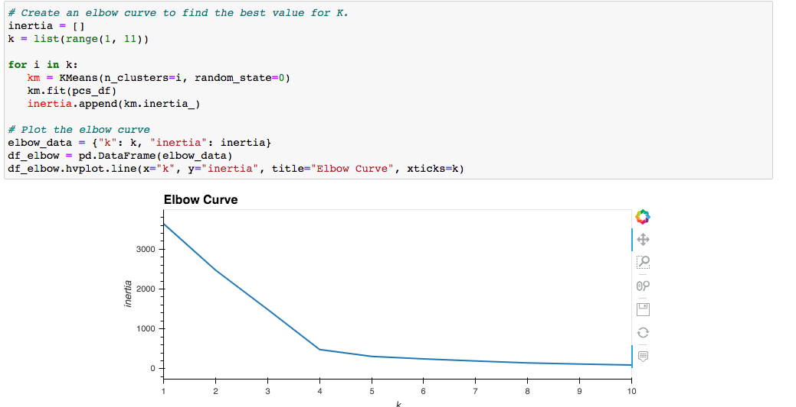

Using the dataset and analysis 4 clusters were found to be the initial point.

After running an analysis using K=4 and applying the K-means algorithm, this was the result:

Build a new dataframe names: `clustered_df` 

* Adding the `CoinNames` column from the `cc_names_df` dataset created.  
* Merging the `crypto_df` and `pcs_df` DataFrames with the same index. 

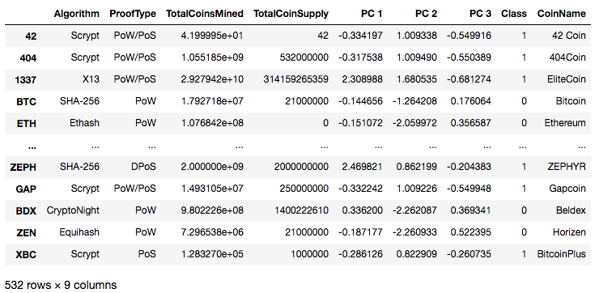

# Deliverable 4:  
## Visualizing Cryptocurrencies Results 
### Deliverable Requirements:

Using your knowledge of creating scatter plots with Plotly Express and `hvplot`, you’ll visualize the distinct groups that correspond to the three principal components you created in Deliverable 2, then you’ll create a table with all the currently tradable cryptocurrencies using the `hvplot.table()` function.

**Follow the instructions below:**

Follow the instructions below and use the information in the crypto_clustering_starter_code.ipynb file to complete Deliverable 4.

1. Continue using the crypto_clustering.ipynb file from Deliverable 3 where you have predicted the K clusters for the cryptocurrencies’ data.
2. Create a 3D scatter plot using the Plotly Express scatter_3d() function to plot the three clusters from the clustered_df DataFrame.
3. Add the CoinName and Algorithm columns to the hover_name and hover_data parameters, respectively, so each data point shows the CoinName and Algorithm on hover.
4. Create a table with tradable cryptocurrencies using the hvplot.table() function.

Your table should look like the table in the image below:

5. Print the total number of tradable cryptocurrencies in the clustered_df DataFrame.
6. Use the MinMaxScaler().fit_transform method to scale the TotalCoinSupply and TotalCoinsMined columns between the given range of zero and one.
7. Create a new DataFrame using the clustered_df DataFrame index that contains the scaled data you created in Step 5.
8. Add the CoinName column from the clustered_df DataFrame to the new DataFrame.
9. Add the Class column from the clustered_df DataFrame to the new DataFrame.

Your new DataFrame should look similar to the image below:

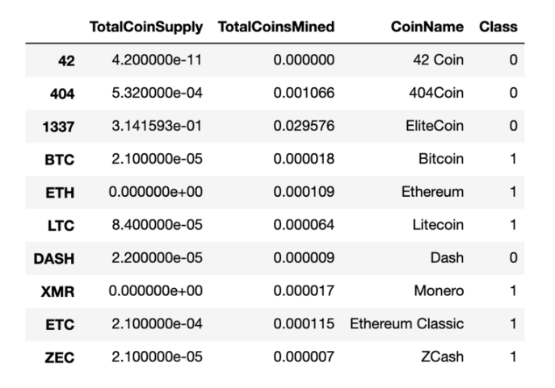

10. Create an hvplot scatter plot with x="TotalCoinsMined", y="TotalCoinSupply", and by="Class", and have it show the CoinName when you hover over the the data point.

Your scatter plot should look similar to the image below:

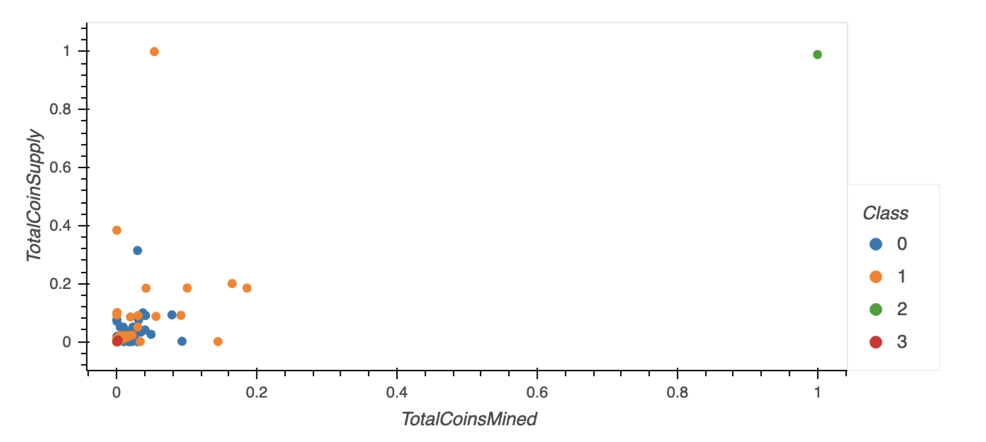

Save your `crypto_clustering.ipynb` file to your **Cryptocurrencies** folder.

### Deliverable 4 Requirements

* The clusters are plotted using a 3D scatter plot, and each data point shows the CoinName and Algorithm on hover
* A table with tradable cryptocurrencies is created using the hvplot.table() function
* The total number of tradable cryptocurrencies is printed
* A DataFrame is created that contains the clustered_df DataFrame index, the scaled data, and the CoinName and Class columns
* A hvplot scatter plot is created where the X-axis is "TotalCoinsMined", the Y-axis is "TotalCoinSupply", the data is ordered by "Class", and it shows the CoinName when you hover over the data point

## Deliverable 4 Results
### Visualizing Cryptocurrencies Results

A new dataset is created using the `MinMaxScaler().fit`_transform method to scale the `TotalCoinSupply` and `TotalCoinsMined` columns from the `clustered_df`, adding the `CoinName` from `cc_names_df` and the `Class` column from `clustered_df`.  

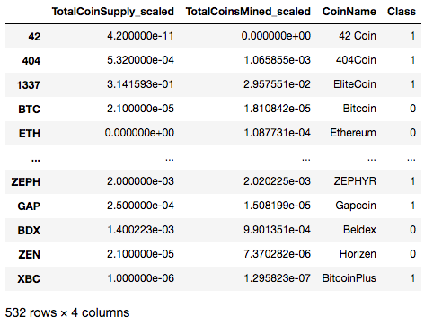

A table is created featuring the tradable cryptocurrencies using the `hvplot.table()`.

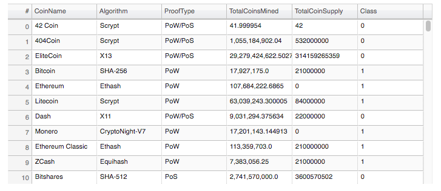

A 2D hvplot scatter plot with `x="TotalCoinsMined_scaled"`, `y="TotalCoinSupply_scaled"`, and `by="Class"` with the `CoinName` displayed.

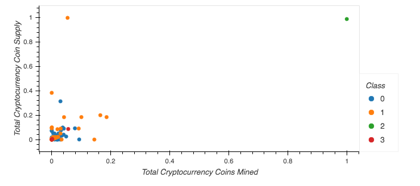

Class 2 and Class 3 are the same; Classes 0 and 1 gave out three different Classes: 0, 1, 4.

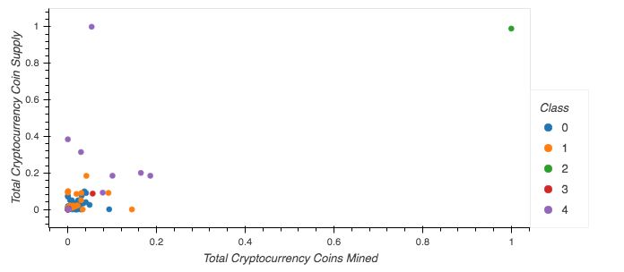

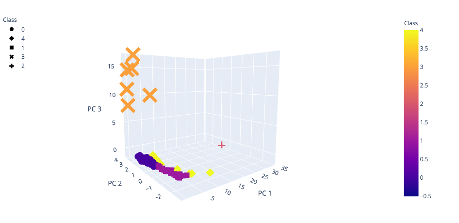

With this new DataFrame, `clustered_df` , we start with a 3D Scatter plot using the Plotly Express `scatter_3d()` function to visualize the 4 Classes.  

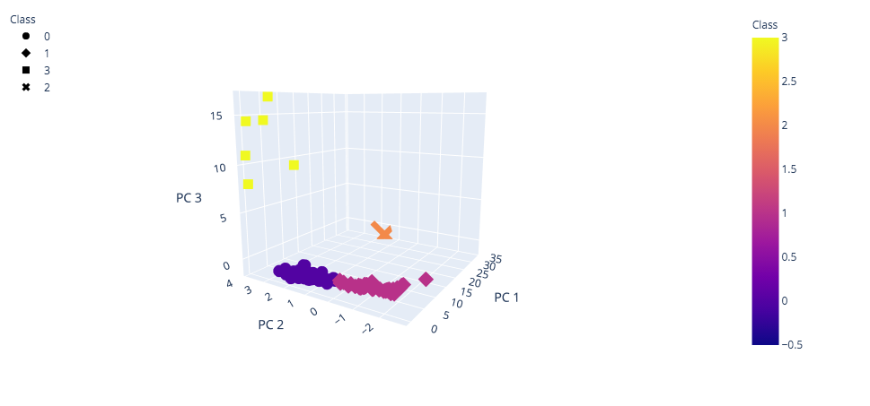